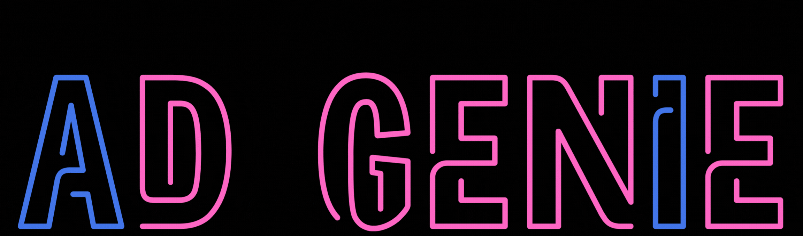
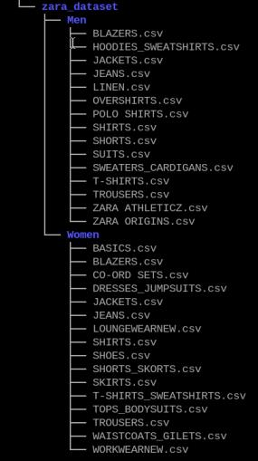

# AD GENIE - Personalized Advertisement 

### [Watch our beautifully illustrated demo!](<https://youtu.be/_PN4cdiFKmw>)

## Overview
This project personalizes ads using the CLIP model. 
It runs on Raspberry Pi 5, AI+ HAT (with the Hailo 8 device).
The project is a runtime project which receives an input from a USB camera (of a person wearing a certain outfit) and outputs images of the outfit that fits most the "style" of the person (from a certain database).

This system resembles a content personalization system in public spaces, and is capable of interacting with nearby individuals and tailoring commercial content to their preferences.

The system can be utilized in various public settings, such as shopping malls, street billboards, and bus station displays. In retail settings, it serves as a tool to elevate the looks of shop window displays, attracting and engaging customers to enter the store.

 ## Setup Instructions
- Follow README setup instructions of [CLIP application example](../../README.md) 

- Register and download zara dataset from [Zara Dataset](https://www.kaggle.com/datasets/abhinavtyagi2708/zara-dataset-men-and-women-clothing)

- There is a 'Men' dir under a 'Men' dir and same for women, delete it, it should look like:



- Run data_preparation.py script it will create zara.json and images dir with all the images under resources directory:
    ```bash
    python data_preparation.py --data <path to zara dataset>
    ```
- Run lables_preparation.py script it will create zara.json and images dir with all the images under resources directory:
    ```bash
    python lables_preparation.py --data <path to zara.json>
    ``` 
- Create data embeddings: (It will take 15 mins)
    ```bash
    text_image_matcher --texts-json resources/lables.json --output resources/data_embdedding.json
    ```
- Change threshold:
At the begging of the resources/data_embdedding.json file there is threshold, change it from 0.8 to 0.01

## Running Example
```bash
python ad_genie.py -d person -i /dev/video0 --json-path resources/data_embdedding.json --enable-callback
```

## Additional Notes
- Check Your USB camera port using get-usb-camera
